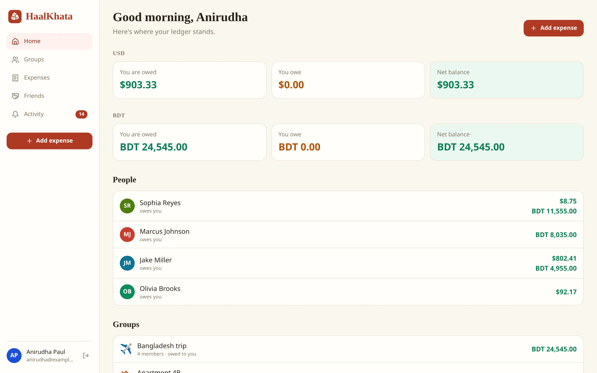
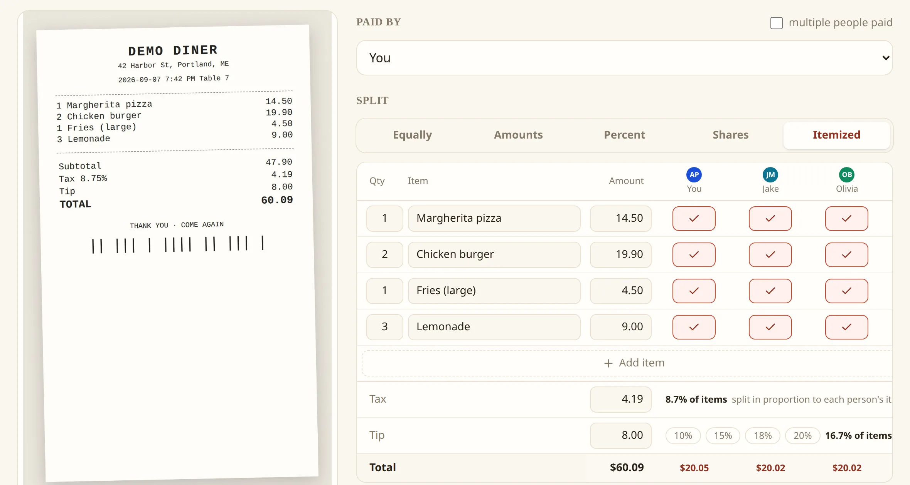
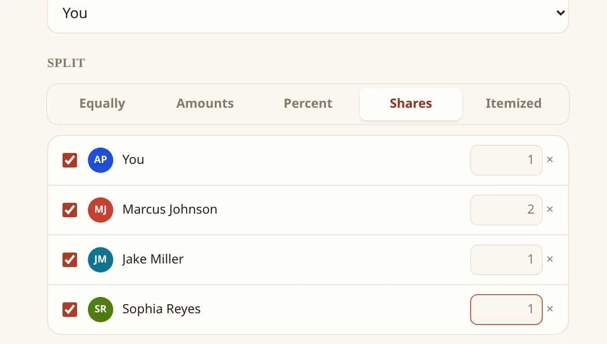
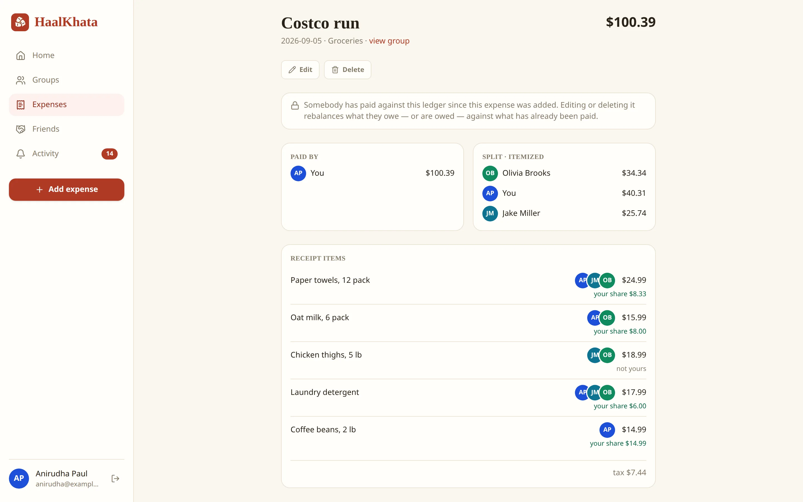
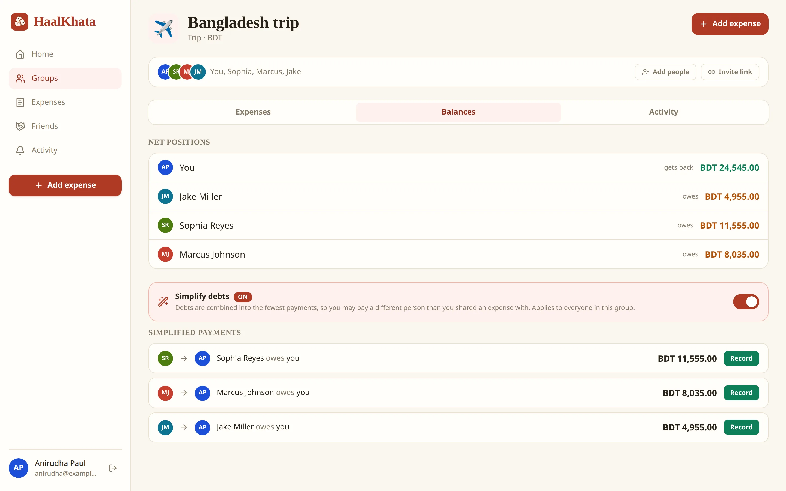
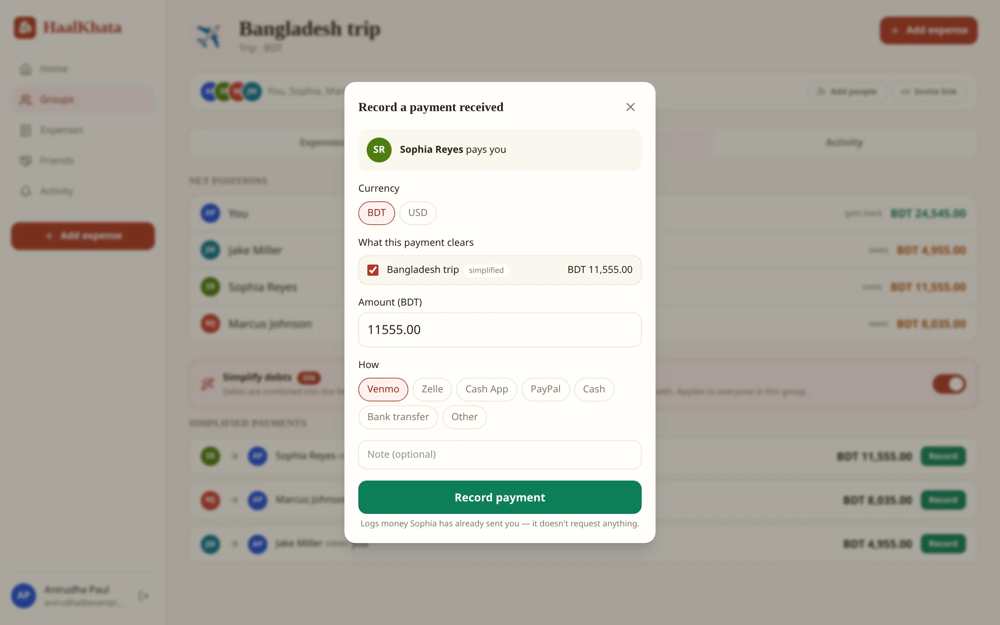
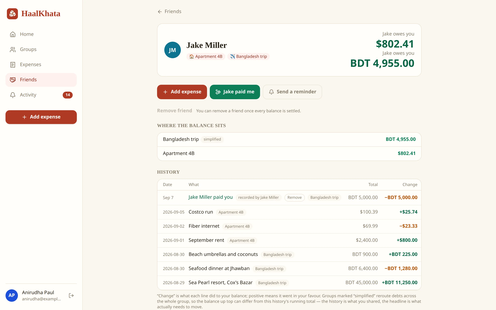
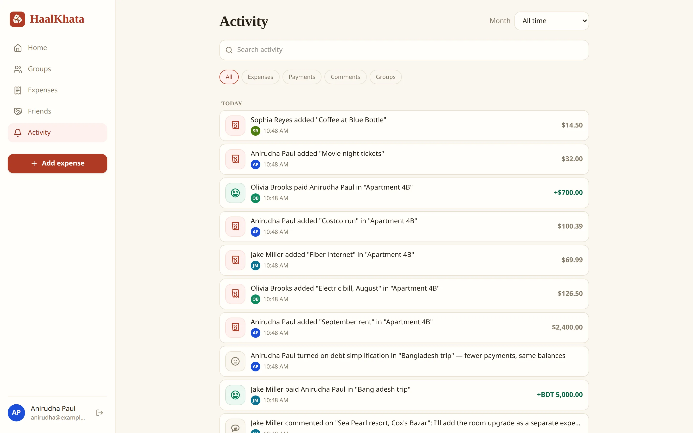
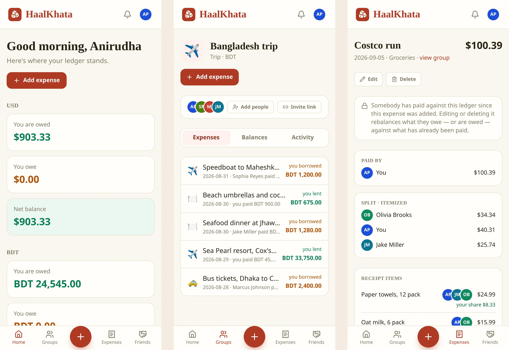

<p align="center">
  
</p>

<h1 align="center">HaalKhata</h1>

<p align="center">
  <strong>Stop being the group accountant.</strong><br>
  Split expenses with roommates, travel buddies, and friends. Scan the receipt, split it by the item, and settle up in one tap.
</p>

<h3 align="center"><a href="https://haalkhata.app">Start splitting at haalkhata.app</a></h3>

<p align="center">
  Free to use. Sign in with Google and you are in.
</p>

<p align="center">
  <a href="https://github.com/anirudha-ani/HaalKhata/actions/workflows/ci.yml"></a>
  <a href="LICENSE"></a>
</p>

<p align="center">
  
</p>

You know the moment. The check arrives, someone grabs it, and a week later a group chat is trying to reconstruct who had the calamari. HaalKhata is the calm ledger that replaces that chat. Put an expense in once, everyone sees the same balances, and settling up becomes a tap instead of a negotiation.

The app is free at [haalkhata.app](https://haalkhata.app). The code behind it is open source so anyone can read exactly how their money is handled, and so the people who use it can help make it better.

## Why people switch

**The apps everyone used started charging for the basics.** Competitor apps now cap their free plans at a handful of expenses a day, put a countdown timer between entries, show full-screen ads you cannot skip, and charge around five dollars a month to lift the limits and switch receipt scanning back on. Splitting a dinner should not need a subscription. HaalKhata is free, with every feature, no ads, and no daily limit.

**Itemized bills stop being a nightmare.** Eight people, one receipt, and somebody had two drinks and no appetizer. Typing that in line by line is why most groups give up and split evenly, and why someone always overpays. HaalKhata reads the receipt for you, everyone taps what they had, and tax and tip follow automatically.

**You can see exactly how it works.** The code is open. Anyone can read how balances are computed and how data is handled, and anyone can help make it better.

## Scan the receipt. Split it by the item.

<p align="center">
  
</p>

Snap a photo at the table. HaalKhata reads the merchant, every line, the tax, and the tip, then lays them out as an itemized split. Check off who had what. Tax and tip follow each person's share automatically, and everyone's total updates as you go.

- Every line is editable before you save, and you can add what the scanner missed.
- The photo is read by an AI model and then discarded. HaalKhata never stores receipt images.

## Split it any way the night went

| Shares, percentages, exact amounts, or equal | Itemized, with each person's share on every line |
| --- | --- |
|  |  |

Equal, exact amounts, percentages, shares, or by line item. Several people can pay one bill. Leave someone out of a round with one uncheck. Comment on any expense when the numbers need a sentence.

## Balances that clean themselves up

<p align="center">
  
</p>

Every group shows who is up, who is down, and the shortest path to zero. Turn on **Simplify debts** and a tangle of who-owes-whom collapses into the fewest possible payments. Balances are also there per friend and across everything you share.

Every currency stays its own currency. A trip in taka and an apartment in dollars show up as two clean numbers, never one made-up total. Any currency you can actually pay in is supported.

## Settle up in one tap

<p align="center">
  
</p>

Record a payment with the method you actually used: Venmo, Zelle, Cash App, PayPal, cash, or a bank transfer. Friends can save their handles so paying them is a tap away. Who recorded a payment is part of the ledger, the other person sees it immediately, and either side can remove it. When someone forgets, a gentle in-app reminder does the awkward part for you.

## Friends, groups, and one link to invite anyone

<p align="center">
  
</p>

<p align="center">
  
</p>

Add a friend by email and they get a request to accept. Put someone in a group, or share a link to a group or to your own profile, and you are connected the moment they open it. Not on HaalKhata yet? Invite them by email or phone and they appear in your group as invited, ready to split the moment they sign up.

## Nothing slips by

<p align="center">
  
</p>

Every expense, payment, comment, and group change lands in one feed you can search and filter. Notifications reach you for anything that touches your balance.

## It fits in your pocket

<p align="center">
  
</p>

HaalKhata installs to your home screen from the browser and works like an app. A native iOS and Android app is being built on the same foundation, and its code is already in this repository.

## Built to be trusted with your money

Splitting money with friends only works if nobody has to wonder about the tool. Here is what HaalKhata does about that. All of it is in this repository, where anyone can read it.

**Your data is not the product.** There are no ads, no analytics, and no trackers in the app. Your ledger is stored for one reason: to show it back to you and the people you split with. The only outside services involved are Google for sign-in, Twilio for optional phone verification, and the AI model that reads a receipt when you scan one.

**Sign-in is hard to fake.** You sign in with Google, and HaalKhata checks every sign-in against Google's own keys and a one-time code it issued. Your session is kept in a cookie no script can read, and any session can be ended from the server.

**The math cannot drift.** Amounts are whole cents everywhere, so there is no rounding error to argue about. The server recomputes every split from what you entered and rejects anything that does not add up. A payment always records who entered it, and each currency is kept separate, never converted.

**The receipt scanner forgets.** A receipt photo is sent to the AI model and never written to disk. The model is asked not to retain it either, and a scan that fails simply fails, rather than inventing line items.

**Locked down where it runs.** Passwords and keys are read from protected files, never from the environment. The app runs in containers with a read-only filesystem and the fewest permissions possible, only the web ports are open, and all traffic is encrypted.

**Every change is checked.** Nothing ships until it passes type checks, lint, unit and property tests, a check that the API contract did not break, a dependency vulnerability audit, and a scan for accidentally committed secrets.

**Backed up every night.** Your data is backed up nightly. Each backup is encrypted before it leaves the server, stored in a second location, and checked to make sure it actually arrived.

**Found something?** Please report it privately through the [security policy](SECURITY.md) rather than in a public issue.

## Help make it better

HaalKhata is open source so the people who use it can shape it. Bug reports, ideas, and pull requests are all welcome. To work on it locally:

```sh
git clone https://github.com/anirudha-ani/HaalKhata.git && cd HaalKhata
./install-deps.sh    # Node, pnpm, Docker, buf, dependencies
./dev.sh             # Postgres + the web app at http://127.0.0.1:3000
```

That gives you a working copy with a mock receipt scanner and no API keys needed. Read [`AGENTS.md`](AGENTS.md) first for the layering rules and conventions that CI enforces.

| I want to… | Read |
| --- | --- |
| Run it on my laptop | [Getting started](docs/getting-started.md) |
| Work on the code | [Development](docs/development.md) and [`AGENTS.md`](AGENTS.md) |
| Understand the API | [Backend services](docs/backend/README.md) |
| Everything else | [Docs index](docs/README.md) |

## Under the hood

Next.js, ConnectRPC with Protobuf, Postgres 17 in plain SQL, TanStack Query, Expo, Caddy, and Docker Compose. One schema-first contract generates the types for the server, the web client, and the mobile app, so the three can never disagree about what an expense is.

## About the name

A *haal khata* is the fresh ledger shopkeepers in Bengal open each new year, once the old accounts are settled. Clean pages, everyone square. That is the feeling this app is after.

## License

HaalKhata is released under the [GPL-3.0](LICENSE).
